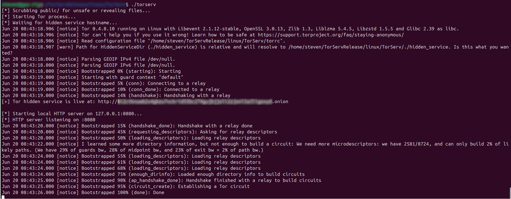

## 🛠️ TorServ

**TorServ** is a zero-configuration static web server that instantly launches as a **Tor hidden service**, with no setup or dependencies. It’s built for **anonymous, censorship-resistant hosting** in privacy-critical or high-risk environments.

Unzip and run — TorServ includes hardened security defaults, built-in Tor integration, and a multilingual landing page to help visitors stay safe on the dark web.

📢 **Follow development**: [@TorServ1](https://x.com/TorServ1)

🔗 **Main Website**: [https://torserv.org](https://torserv.org)

🛠️ **Website Source Code**: [https://github.com/torserv/torserv-web](https://github.com/torserv/torserv-web)

[](https://github.com/torserv/torserv/stargazers)
[](https://github.com/torserv/torserv/releases)

[](https://paypal.me/torserv)

<p align="center">
  <br>
  <em>TorServ automatically launching your Tor hidden service with no setup</em>
</p>

---

## 🧅 Onion Mirror

TorServe.org is accessible via the Tor network:

**torservqv27yflqzhe75mojvxp364rfhqjobkte4q5v2u2jjuokchoid.onion**

Use the [Tor Browser](https://www.torproject.org/) to visit.

---

## 💬 Join the Discussion

Have ideas? Questions? Concerns?
Whether you're a privacy expert or just Tor-curious, your input matters.

👉 [Join the discussions](https://github.com/torserv/torserv/discussions) and help steer TorServ in the right direction — no question is too small, all feedback is welcome and encouraged.

---

## 🧭 Quick Start

**Unzip → Execute binary → Get instant `.onion` address**

The Tor hidden service starts automatically. The `.onion` address is printed to the console.

---

## 🎯 Project Goals

* 🧳 **Zero-config setup:** unzip → run → receive `.onion` URL
* 🕳️ **No clearnet exposure:** listens only on `127.0.0.1`
* 🕵️ **Privacy-first:** no logs, no outbound traffic, no analytics
* 🛡️ **Safe defaults for hostile environments** *(assume compromise, not safety)*
* 🌐 **Multilingual landing page** with built-in safety guide (no JS required)
* 💻 **Prebuilt binaries** for Linux (x64) and Raspberry Pi (ARMv7/ARM64)

---

## ✨ Key Features

* ✅ **Hardened static file server** written in Go (raw TCP, no framework)
* ✅ **Automatic Tor hidden service**, self-contained (bundled `tor`)
* ✅ **Multilingual `index.html`** with embedded safety instructions
* ✅ **Image metadata scrubbing** for JPEG, PNG, GIF, BMP
* ✅ **Optional `.onion` key rotation** via `--new-key`
* ✅ **Encrypted file paths in HTML** — no filenames or directories exposed
* ✅ **Chunked transfer encoding + response padding** to resist fingerprinting
* ✅ **Timing jitter (50–200ms)** masks request-response patterns
* ✅ **No JS, no clearnet fetches, no cacheable responses**

---

## 🧠 Safety Features

* 🔐 **Header Sanitization** – Strips `Date`, `ETag`, `Last-Modified`, `User-Agent`, etc.
* 🧱 **Localhost Binding Only** – Never exposed to public interfaces
* 🧼 **Metadata Scrubbing** – EXIF and other metadata removed from supported image types
* 🕒 **Timing Obfuscation** – Adds random response delay to reduce timing attacks
* 📦 **Response Padding** – Uniform response sizes to prevent content inference
* 🚫 **No Caching** – Disables all cache headers to avoid leak-through
* 🧳 **Offline-Only Assets** – Fully self-contained; no JS, fonts, or network calls
* 🌍 **Static Safety Guide** – Tabbed multilingual HTML, fully local
* 🧊 **File/Path Obfuscation** – Encrypted file references, not human-readable
* 🤖 **Scanning Bot Trap** – Bots scanning for non existent directories/files get a slow trickle of garbage instead of 404
* 🔒 **Firejail Sandboxing** – Automatically runs in a lightweight security sandbox if Firejail is installed

---

## 🖥️ Installation & Usage

### 🐧 Linux (x86\_64)

```bash
unzip torserv-linux-amd64.zip
cd TorServ
./torserv
```

### 🍓 Raspberry Pi (ARM64)

```bash
unzip torserv-rpi-arm64.zip
cd TorServ
./torserv
```

> The Tor hidden service will start and print a `.onion` address to the terminal.
> Use [Tor Browser](https://www.torproject.org/download/) to access it.

### 🚫 Windows

⚠️ **Note:** Windows release dropped due to aggressive antivirus false positives.
You may still build from source if desired.

---

## 🔒 Running TorServe Safely with Firejail

TorServe now includes **built-in Firejail sandboxing**. If Firejail is installed, TorServe will automatically re-execute itself inside a secure container to reduce attack surface.

### ✅ Default Behavior

Just run TorServe as usual:

```bash
./torserv
```

If Firejail is available, you’ll see:

```
[*] Launching inside Firejail sandbox...
```

If Firejail is not installed, TorServe will still run normally and recommend installing it for improved security.

### ❎ Disable Firejail

To skip sandboxing (e.g., for debugging):

```bash
./torserv --no-firejail
```
### 🛠️ Installing Firejail (Debian/Ubuntu)

```bash
sudo apt update
sudo apt install firejail
```
---

## 🛠️ Build from Source

torserv is written in Go and requires the Tor binary to be present in a `tor/` directory inside the project.

### 📦 Requirements

* Go 1.20+
* Git
* `tor` binary (from [torproject.org](https://www.torproject.org/download/tor/))
* Optional: cross-compilers for other platforms

### 📁 Setup Instructions

```bash
git clone https://github.com/torserv/torserv.git
cd TorServ
mkdir tor/
```

### 🔍 Install Tor Binary

#### Linux (Debian-based)

```bash
sudo apt update
sudo apt install tor
which tor
cp $(which tor) tor/
```

> Same applies on Raspberry Pi if using Raspbian/Debian.

#### Windows

Download the [**Tor Expert Bundle**](https://www.torproject.org/download/tor/) and place `tor.exe` into `tor\`.

### 🔧 Build Commands

#### 🐧 Linux (x86_64 or ARM64, including Raspberry Pi from local terminal)

```bash
go build -o release/linux/TorServ/torserv ./cmd/torserv
```

#### 🪟 Windows (Cross-compile from Linux/macOS)

```bash
sudo apt update
sudo apt install gcc-mingw-w64

GOOS=windows GOARCH=amd64 CC=x86_64-w64-mingw32-gcc \
CGO_ENABLED=0 go build -o release/windows/TorServ/torserv.exe ./cmd/torserv
```

#### 🍓 Raspberry Pi 4+ (ARM64, cross-compiled)

```bash
sudo apt update
sudo apt install gcc-aarch64-linux-gnu

GOOS=linux GOARCH=arm64 CC=aarch64-linux-gnu-gcc \
CGO_ENABLED=0 go build -o release/rpi/TorServ/torserv ./cmd/torserv
```

---

### 📂 After Building

Your binary will be in:
`release/<platform>/TorServ/`

Copy it to the project root to run:

```bash
./torserv
```

torserv will auto-launch the Tor hidden service if `tor/` is present. If not, it will exit.

---

## 🌍 Demo Page Language Support

* English (default)
* 简体中文 (Simplified Chinese)
* Español (Spanish)
* Русский (Russian)
* <span dir="ltr">فارسی (Farsi)</span>
* Italiano (Italian)
* 한국어 (Korean)

---

## 📜 License

This project is licensed under the MIT License (see LICENSE file)

---

## 🧭 Support the Tor Project

You’ll need the [Tor Browser](https://www.torproject.org/download/) to access `.onion` sites.

If you care about privacy, consider supporting the [Tor Project](https://support.torproject.org/).

---

## 👋 Contributing

Welcoming:

* 🔐 Security audits
* 🐞 Bug reports
* 🌟 Feature requests
* 🌍 Translations
* 💻 Code contributions
* 🧠 Thoughtful feedback
* 💸 [Financial support](https://paypal.me/torserv) - This project incurs monthly expenses to run

---

### 🧅 Tor Binary Licensing

torserv bundles the unmodified official `tor` binary for convenience.
Tor is licensed under the **BSD 3-Clause License**.

This project is **not affiliated with or endorsed by the Tor Project**.
All credit for Tor belongs to [The Tor Project](https://www.torproject.org/).
